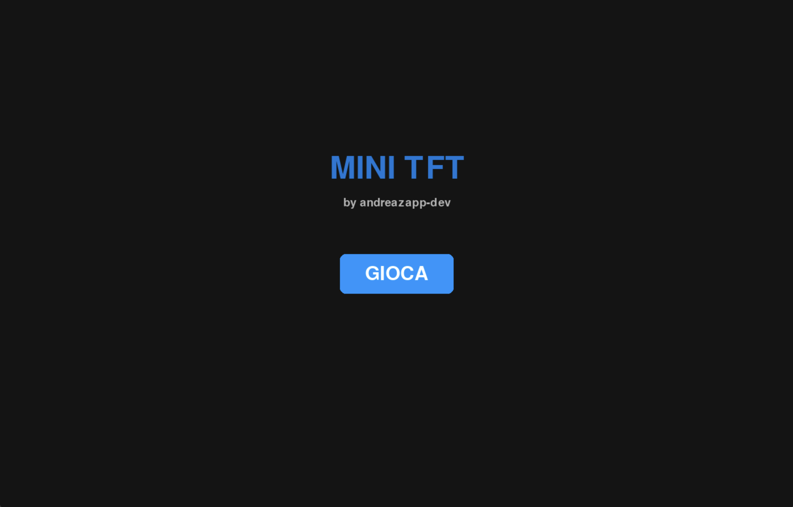
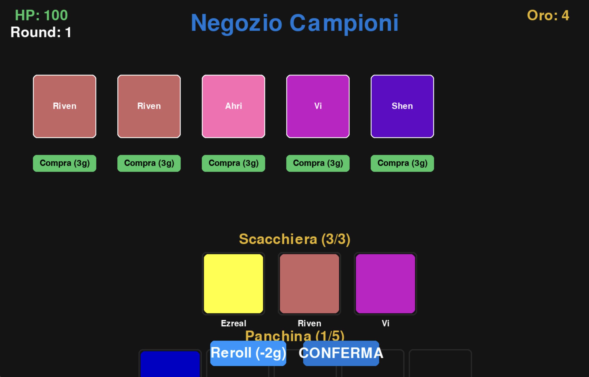
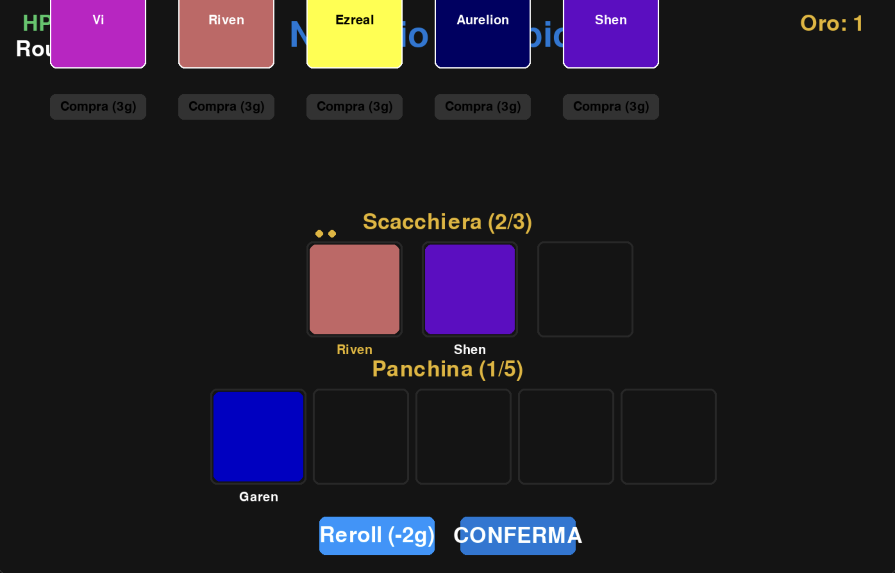
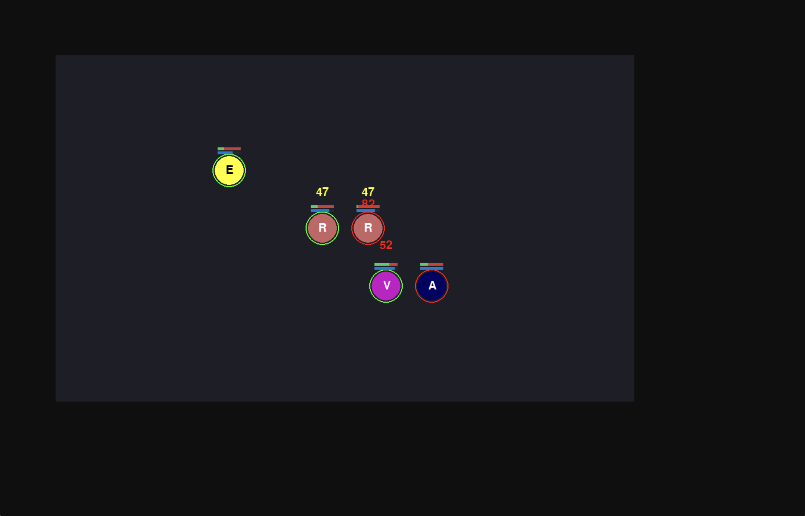

# 🎮 TFT Auto-Battler Prototype (Python / Pygame)

> **⚠️ Visual & Audio Disclaimer**  
> This project is a functional system prototype focused on gameplay mechanics (AI, economy, state machine).  
> To respect Riot Games’ Intellectual Property rights, all original assets have been replaced with colored placeholders (greyboxing), and audio is disabled.  
> **The game is fully playable out-of-the-box without any external assets.**

---

<p align="center">
  
  &nbsp; &nbsp; 
</p>

<p align="center">
  
  &nbsp; &nbsp; 
</p>

<p align="center">
  <em>Gameplay Overview: Shop, Bench Management, and Combat Phases</em>
</p>

---

## 🧩 Project Overview

This repository contains the development of a 2D Auto-Battler game engine inspired by **Teamfight Tactics**, built entirely in Python.  
The goal is to study and recreate the core gameplay loops of a complex strategy game from scratch.

---

## 🚀 Key Features

### 💰 Economy System
- Currency management  
- Shop logic (buy/sell)  
- Rarity-based probability system  
- Reroll mechanics  

### 🔄 State Management
- Game cycle architecture  
- Distinct **Shop Phase** and **Battle Phase**

### ⚔️ Combat System
- Real-time automatic combat simulation  
- Damage calculation  
- Mana gain and ability casting  
- Basic AI behavior

### ⭐ Merge System
- Unit combination logic  
- Star-up mechanic implementation

---

## 🛠️ Tech Stack
- **Python**
- **Pygame**

---

## 📦 Project Goals
✔️ Recreate the main game loops of an Auto-Battler  
✔️ Implement modular systems for AI, economy, and combat  
✔️ Build a foundation for future expansions or new modes  

---

## 💻 How to Run

1. **Clone the repository**
   ```bash
   git clone https://github.com/andreazapp-dev/TFT-Python-Prototype.git
   cd TFT-Python-Prototype
   pip install pygame
   python game.py 
   ```

---

## 👤 Author
**andreazapp-dev** [LinkedIn Profile](https://www.linkedin.com/in/andrea-zappavigna98)